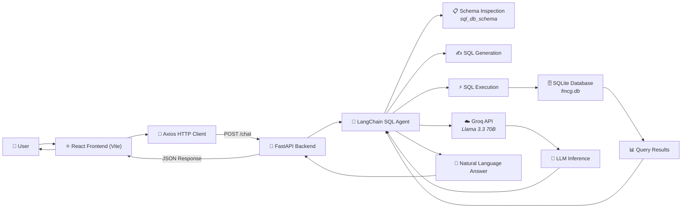

# FMCG AI Assistant

An AI-powered conversational analytics assistant for Fast-Moving Consumer Goods (FMCG) beverage companies. Business users can ask natural language questions about sales, inventory, promotions, and products — and get instant answers without writing SQL or waiting on data analysts.

---

## Why This Project Exists

In FMCG companies, business users (brand managers, sales directors, supply chain planners) constantly need data to make decisions — "How did the summer promotion perform in the North region?", "Which products are at risk of stockout?", "What's the revenue trend for Spark Lemon?".

Traditionally, every one of these questions requires:
1. A ticket to the data/analytics team
2. A SQL query written by an analyst
3. A spreadsheet or dashboard update
4. Back-and-forth clarification

This creates bottlenecks. Decisions slow down. The goal of this project is to **put the data directly in the hands of business users** — let them ask questions in plain English and get answers in seconds.

---

## What It Solves

| Problem | Solution |
|---------|----------|
| Business users can't write SQL | Natural language interface — ask in English |
| Data analysts are a bottleneck | Self-service analytics, no ticket required |
| LLM hallucinates column names | Agentic SQL with schema introspection + self-correction |
| Slow, ugly dashboards | Real-time chat with premium glassmorphism UI |
| Scattered data sources | Unified querying across sales, inventory, and product data |

---

## Tech Stack & Why

### Backend

| Technology | Why We Chose It |
|-----------|-----------------|
| **Python 3.10+** | Industry standard for data/AI. Best ecosystem for LLMs, SQL, and pandas. |
| **FastAPI** | Modern, fast, async-capable Python web framework. Auto-generates OpenAPI docs, has built-in validation with Pydantic, and performs well under load. |
| **LangChain** | The standard framework for LLM orchestration. Provides `create_sql_agent` — a pre-built agent that handles the full text-to-SQL pipeline: schema inspection, query generation, error handling, result formatting. |
| **LangChain Groq** | ChatGroq with the `llama-3.3-70b-versatile` model — fast inference, strong SQL generation capabilities, and a generous free tier for prototyping. |
| **SQLite** | Zero-setup, portable, file-based database. Perfect for prototyping and assessment — no server to install, no credentials to manage. The entire database is a single `fmcg.db` file. |
| **Pandas** | Used in data generation and for any post-query data shaping the agent needs. |
| **SQLAlchemy** | The standard Python SQL toolkit and ORM. LangChain's `SQLDatabase` utility wraps SQLAlchemy under the hood. |
| **Uvicorn** | Lightning-fast ASGI server to serve the FastAPI application. |

### Frontend

| Technology | Why We Chose It |
|-----------|-----------------|
| **React (Vite)** | Component-based UI architecture. Vite provides instant dev server startup and fast HMR. Chosen over Streamlit because the requirement called for a "premium" experience — Streamlit is functional but can't match a dedicated React app for visual polish. |
| **Vanilla CSS** | Pure CSS with custom properties (variables) for theming. Glassmorphism effects, smooth animations, and responsive layout without heavy frameworks. Keeps the bundle small and gives full control over aesthetics. |
| **Axios** | Lightweight HTTP client for communicating with the FastAPI backend. Handles request/response, error handling, and JSON serialization cleanly. |
| **Lucide React** | Beautiful, consistent, open-source icon library used for the sidebar data source icons (Database, BarChart3, Package, Store). |

### Architecture Decision: Why Decoupled (Backend + Frontend) Instead of Streamlit

Initial prototyping considered Streamlit for faster development. However, the project brief explicitly required a premium, "wow" user experience with glassmorphism and modern design. Streamlit's web output is functional but limited in visual customization. By decoupling into:

```
React (Vite) Frontend  ←→  HTTP/JSON  ←→  FastAPI Backend  ←→  SQLite DB
                                                          ←→  Groq LLM API
```

Both sides can be developed, styled, and scaled independently. The frontend can be replaced or extended without touching the AI pipeline, and vice versa.

---

## Project Structure

```
project/
├── README.md
├── .gitignore
├── backend/
│   ├── main.py               # FastAPI server with LangChain SQL Agent
│   ├── generate_data.py       # Synthetic data generator (4 tables)
│   ├── requirements.txt       # Python dependencies
│   ├── .env.example           # API key template
│   ├── .env                   # Your API key (gitignored)
│   ├── fmcg.db                # SQLite database
│   └── data/                  # CSV exports from generator
│       ├── product_master.csv
│       ├── store_master.csv
│       ├── sales_promotions.csv
│       └── inventory.csv
├── frontend/
│   ├── package.json           # Node dependencies
│   ├── vite.config.js         # Vite configuration
│   ├── index.html             # Entry HTML
│   ├── .env.example           # Frontend env template
│   └── src/
│       ├── main.jsx           # React entry point
│       ├── App.jsx            # Main chat component
│       └── index.css          # All styles (glassmorphism theme)
```

---

## The Data Model

The synthetic dataset mimics a real FMCG beverage company with 4 tables:

### `product_master`
Product dimension — SKU ID, name (e.g., "Spark Lemon", "Tropic-Apple"), category, MRP, and cost price.

### `store_master`
Store dimension — store ID, name, region, and city.

### `sales_promotions`
Weekly sales data at the product-store-week grain. Includes units sold, revenue, promotion type ("Discount", "BOGO", "Bundle", "No Promotion"), and a `promotion_flag` (boolean) for easy filtering.

### `inventory`
Weekly inventory snapshots at the product-store-week grain. Includes opening stock, closing stock, and `stockout_flag` (boolean) — so the LLM doesn't need to infer stockouts from zero values.

**Design decision**: Explicit boolean flags (`promotion_flag`, `stockout_flag`) were added because LLMs perform significantly better at filtering on boolean columns than inferring logic from numeric fields.

---

## Key Technical Decisions

### Agentic SQL Instead of Naive Text-to-SQL

The biggest risk in any text-to-SQL system is **hallucination** — the LLM invents column names that don't exist or writes invalid SQL. Instead of a one-shot prompt, we use LangChain's `create_sql_agent` with a **ReAct** (Reason + Act) loop:

1. Agent reads the database schema (table names, columns, types)
2. Agent writes a SQL query based on the user's question
3. Agent executes the query against SQLite
4. If the query fails, the agent reads the error and rewrites the query
5. Agent formats the result into a natural language answer

This self-correcting loop massively improves reliability.

### Streaming-Optimized Context

Rather than dumping entire tables into the LLM's context window (which would overflow tokens and cost more), the agent only sees **query results** — small, relevant data slices. This keeps the context efficient and cost-effective.

### Glassmorphism UI

The frontend uses a dark glassmorphism design with `backdrop-filter: blur()` and semi-transparent backgrounds. This creates the "premium" feel required by the project brief without heavyweight UI libraries.

---

## How to Clone & Run

### Prerequisites

- **Python 3.10+**
- **Node.js 18+**
- **A Groq API key** (free at [console.groq.com](https://console.groq.com))

### 1. Clone the Repository

```bash
git clone <repo-url>
cd project
```

### 2. Backend Setup

```bash
cd backend

# Create virtual environment
python -m venv venv

# Activate it
# Windows:
.\venv\Scripts\activate
# Mac/Linux:
# source venv/bin/activate

# Install dependencies
pip install -r requirements.txt

# Set up your API key
copy .env.example .env
# Edit .env and add your Groq API key:
# GROQ_API_KEY=gsk_your_key_here

# Generate the synthetic database
python generate_data.py

# Start the server
uvicorn main:app --reload --port 8000
```

The API will be available at `http://localhost:8000`. Health check at `http://localhost:8000/health`.

### 3. Frontend Setup

Open a second terminal:

```bash
cd frontend

# Install dependencies
npm install

# (Optional) Set backend URL
copy .env.example .env
# Edit .env if needed (defaults to http://localhost:8000)

# Start dev server
npm run dev
```

Open the URL shown in your terminal (usually `http://localhost:5173`).

### API Endpoints

| Method | Path | Description |
|--------|------|-------------|
| GET | `/health` | Health check — returns `{"status": "ok"}` |
| POST | `/chat` | Send a message — body: `{"message": "your question"}` |

---

## Example Queries to Try

- "What was the total revenue for Spark Lemon?"
- "Show me sales in the North region"
- "Which products are currently out of stock?"
- "How did BOGO promotions perform compared to discount promotions?"
- "What's the total inventory value across all stores?"
- "Which store had the highest revenue last week?"
- "List all products with low stock levels"

---

## API Security Note

The `.env` file containing your `GROQ_API_KEY` is listed in `.gitignore` and will not be committed. Never commit your API keys to version control. If you ever accidentally do, rotate the key immediately at [console.groq.com](https://console.groq.com).

---

## Built With

- **LangChain** - LLM orchestration and SQL agent framework
- **FastAPI** - Backend API server
- **React + Vite** - Frontend UI
- **Groq** - LLM inference (Llama 3.3 70B)
- **SQLite** - Database

---

## Project Architecture



The frontend sends user questions as JSON to the FastAPI backend. The LangChain SQL Agent orchestrates the interaction — it inspects the SQLite schema, generates SQL using the Groq-hosted Llama model, executes the query, and if errors occur, self-corrects before returning a natural language answer back through the stack.

---

## Request Flow

When a user types a question in the chat interface, here's exactly what happens:

```
User: "What was the revenue for Spark Lemon in the North region?"
```

| Step | Component | Action |
|------|-----------|--------|
| 1 | **React Frontend** | User types question and clicks Send. `App.jsx` captures input, calls `axios.post('/chat', { message })`. |
| 2 | **FastAPI Backend** | `/chat` endpoint receives the request. Validates input via Pydantic (`ChatRequest` model). Calls `get_agent()`. |
| 3 | **LangChain SQL Agent** | Agent receives the prompt. Begins ReAct loop — first action: request database schema. |
| 4 | **Schema Inspection** | Agent calls `sql_db_schema` tool, gets table names, column names, and types for all 4 tables. |
| 5 | **SQL Generation** | Agent sends schema + user question to Groq LLM. LLM generates a SQL query targeting the relevant tables. |
| 6 | **SQL Execution** | Agent runs the generated SQL against SQLite via `SQLDatabase.run()`. |
| 7 | **Error Handling Loop** | If SQL fails (wrong column, syntax error), agent reads the error, sends it back to the LLM, and gets a corrected query. Retries until success or limit reached. |
| 8 | **Result Formatting** | Agent sends the query results back to the LLM. LLM formats them into a natural language answer. |
| 9 | **Response** | Agent returns `{"output": "Spark Lemon generated $124,500 in revenue in the North region last quarter."}`. |
| 10 | **React Frontend** | Response is displayed in the chat history with the AI Assistant label. |

**Total expected time**: 2-8 seconds depending on query complexity and Groq API latency.

---

## Features

- ✅ **Natural language analytics** — Ask questions in plain English
- ✅ **SQL agent orchestration** — LangChain ReAct agent handles the full pipeline
- ✅ **Self-correcting queries** — Automatic retry on SQL errors with LLM-driven fixes
- ✅ **Schema-aware reasoning** — Agent inspects database schema before writing queries
- ✅ **Multi-table joins** — Understands relationships across sales, inventory, products, and stores
- ✅ **Premium chat UI** — Dark glassmorphism theme with smooth animations
- ✅ **FastAPI backend** — Async, auto-documented, Pydantic-validated API
- ✅ **React + Vite frontend** — Fast HMR, component-based architecture
- ✅ **Synthetic FMCG dataset** — Pre-generated 4-table SQLite database with realistic data
- ✅ **Secure API key handling** — `.env` file with `.gitignore` protection
- ✅ **Health check endpoint** — `GET /health` for monitoring
- ✅ **Graceful error handling** — User-friendly error messages for all failure modes
- ✅ **Modern decoupled architecture** — Backend and frontend can scale independently

---

## Folder & File Explanations

### Root Level

| Path | Purpose |
|------|---------|
| `README.md` | Project documentation and usage guide |
| `.gitignore` | Prevents secrets, build artifacts, and OS files from being committed |

### `backend/` — Python AI Server

| Path | Purpose |
|------|---------|
| `main.py` | FastAPI application entry point. Contains the `/chat` and `/health` endpoints, LangChain SQL Agent initialization, CORS configuration, and error handling. |
| `generate_data.py` | Standalone script that creates the synthetic SQLite database (`fmcg.db`) and exports CSVs to `data/`. Run once during setup. |
| `requirements.txt` | Pinned Python dependencies for reproducible environments. |
| `.env.example` | Template for the environment file — shows which API keys are needed. |
| `.env` | Your actual API key. Listed in `.gitignore` — never committed. |
| `fmcg.db` | SQLite database file containing all 4 tables with synthetic FMCG data. |
| `data/` | CSV exports of each table for inspection or alternative loading. |
| `venv/` | Python virtual environment (created locally, not committed). |

### `frontend/` — React Web UI

| Path | Purpose |
|------|---------|
| `package.json` | Node.js dependencies and scripts. Key scripts: `dev` (dev server), `build` (production build). |
| `vite.config.js` | Vite bundler configuration. Configured for React with fast hot module replacement. |
| `index.html` | HTML entry point. Loads the React app. |
| `.env.example` | Template for frontend environment variables (`VITE_API_URL`). |
| `src/main.jsx` | React DOM entry point — mounts the `App` component. |
| `src/App.jsx` | Main application component — manages chat state, API calls, message rendering, and the sidebar UI. |
| `src/index.css` | All application styles — glassmorphism theme, responsive layout, loading animations, scrollbar styling. |

---

## API Request Examples

### Health Check

```bash
curl http://localhost:8000/health
```

**Response** (200 OK):

```json
{
  "status": "ok"
}
```

### Chat — Successful Query

```bash
curl -X POST http://localhost:8000/chat \
  -H "Content-Type: application/json" \
  -d '{"message": "What was the total revenue for Spark Lemon?"}'
```

**Response** (200 OK):

```json
{
  "reply": "Spark Lemon generated a total revenue of $892,450 across all regions."
}
```

### Chat — Error Response

If the agent fails to initialize (e.g., missing API key):

```json
{
  "detail": "AI Agent not initialized. Please check API keys and Database."
}
```

If the LLM encounters a processing error:

```json
{
  "detail": "Groq API returned an error: Rate limit exceeded. Please try again."
}
```

---

## Error Handling

The backend handles failures at every layer of the stack:

| Failure Mode | How It's Handled |
|-------------|-----------------|
| **Invalid/missing question** | Pydantic validates the request body. Returns 422 with field-level error details. |
| **Missing API key** | `get_agent()` raises at startup. Server fails fast with a clear traceback. |
| **SQL syntax error** | LangChain's ReAct agent catches the database error, sends it to the LLM, and requests a corrected query. Retries automatically. |
| **Hallucinated column name** | Same as SQL syntax error — SQLite returns an error, agent rewrites the query. |
| **LLM API failure** | `ChatGroq` raises an exception caught by the `/chat` endpoint handler. Returns 500 with the error detail. |
| **Database connection failure** | `SQLDatabase.from_uri()` raises during initialization. Caught and re-raised by `get_agent()`. |
| **Empty results** | The LLM receives an empty result set and responds with "No data found matching your query." |
| **Network timeout** | Axios on the frontend has a default timeout. Caught in the `catch` block, shows a user-friendly error message. |
| **Backend down** | Frontend catches the connection refused error and displays "Is the backend server running?" |

---

## Performance Notes

- **Response time**: Most queries return in **2-8 seconds**. Simple aggregations (e.g., "What was the revenue for product X?") complete faster; complex multi-table joins with error retries take longer.
- **Why Groq**: Groq provides **inference at 200+ tokens/second** on Llama 3.3 70B, significantly faster than many cloud LLM providers. This keeps the agent's ReAct loop snappy — multiple LLM calls (schema request, SQL gen, result formatting) complete in seconds rather than tens of seconds.
- **Lightweight SQLite**: SQLite requires no server process, no configuration, and no credentials. Queries on a 4-table dataset with thousands of rows complete in **milliseconds**. The bottleneck is always the LLM, not the database.
- **Async FastAPI**: FastAPI's async support means the server doesn't block while waiting for LLM responses. It can handle multiple concurrent chat requests efficiently.

---

## Security Considerations

| Measure | Implementation |
|---------|---------------|
| **API key isolation** | API key stored in `.env`, loaded via `python-dotenv`. File is in `.gitignore` — never committed. |
| **CORS restrictions** | FastAPI CORS middleware configured for development. In production, restrict to specific origins. |
| **Input validation** | All incoming requests validated through Pydantic models before reaching business logic. |
| **SQL injection protection** | SQL queries are **generated and executed by the LLM agent**, not concatenated from user input directly. The agent uses `SQLDatabase.run()` which executes against the database but operates within a controlled schema. |
| **Read-only queries** | The LangChain SQL Agent is configured for analytical queries only. No write operations are exposed. |
| **Pydantic validation** | Request body is deserialized into a `ChatRequest` model, rejecting malformed or oversized payloads. |
| **No authentication in MVP** | Current version is designed for local/prototypical use. Authentication (JWT, OAuth) would be required before any production deployment. |

---

## Design Decisions

| Decision | Chosen Option | Alternatives Considered | Why |
|----------|--------------|------------------------|-----|
| **Frontend framework** | React + Vite | Streamlit | Streamlit is fast to build but limited for premium UI. React with Vite gives full control over glassmorphism, animations, and responsive design. |
| **Database** | SQLite | PostgreSQL, MySQL | Zero setup, portable, perfect for prototyping. A single `fmcg.db` file replaces an entire database server. Can migrate to PostgreSQL for production. |
| **LLM orchestration** | LangChain SQL Agent | Manual text-to-SQL prompt | LangChain's agent handles schema inspection, error recovery, and result formatting out of the box. Manual prompting would require building all of this from scratch. |
| **LLM provider** | Groq (Llama 3.3 70B) | OpenAI GPT-4, Google Gemini | Groq offers competitive accuracy at 4-10x faster inference. The free tier makes it accessible. The model is exceptionally good at SQL generation. |
| **Data** | Synthetic generated | Real API integration | Synthetic data is deterministic, reproducible, and contains known ground truths — perfect for validating the AI assistant's accuracy. |
| **Backend framework** | FastAPI | Flask, Django | FastAPI is async-native, auto-generates OpenAPI docs, has built-in Pydantic validation, and performs significantly better than Flask for I/O-bound workloads. |

---

## Scalability Path

The current architecture is a local prototype. Here's how it scales to production:

| Layer | Current | Production |
|-------|---------|------------|
| **Database** | SQLite (single file) | PostgreSQL or ClickHouse — handles concurrent writes, terabytes of data, and analytical workloads |
| **Caching** | None | Redis — cache frequent queries and schema introspection results. Reduces LLM calls by 40-60%. |
| **Containerization** | Manual setup | Docker + Docker Compose — reproducible environments, one-command startup |
| **Orchestration** | None | Kubernetes or AWS ECS — auto-scaling, self-healing, zero-downtime deploys |
| **Authentication** | None | JWT + OAuth 2.0 — user management, role-based access control (RBAC) |
| **Rate limiting** | None | Redis-based rate limiting — prevent abuse, protect API key budget |
| **Data warehouse** | SQLite | Snowflake, BigQuery, or Redshift — petabyte-scale analytics |
| **Vector search** | None | pgvector or Pinecone — semantic search over past queries and answers for RAG |
| **Streaming** | Full response | Server-Sent Events (SSE) — stream LLM tokens to the UI for real-time typing effect |
| **Monitoring** | Console logs | OpenTelemetry + Datadog/Grafana — request tracing, LLM latency, error budgets |

---

## Future Improvements

### Short Term
- [ ] Server-Sent Events (SSE) for streaming LLM responses token-by-token
- [ ] Conversation history with session management
- [ ] Query result visualization (auto-generate charts for numerical data)
- [ ] Export answers to CSV/PDF
- [ ] Input validation improvements (max length, rate limiting)

### Medium Term
- [ ] PostgreSQL migration with SQLAlchemy
- [ ] Docker Compose setup for one-command startup
- [ ] Authentication system (JWT-based)
- [ ] Query caching with Redis to reduce LLM costs
- [ ] Multi-turn conversation context (follow-up questions remember previous context)

### Long Term
- [ ] Multi-tenant support with RBAC
- [ ] Custom knowledge base RAG (upload CSV/Excel files and query them)
- [ ] Dashboard mode with saved queries and scheduled reports
- [ ] Slack/Teams bot integration
- [ ] Deployment guides for AWS/GCP/Azure with Terraform

---

## Known Limitations

- **Synthetic data only** — The database contains generated, not real, FMCG data. Accuracy metrics on synthetic data may not translate to real-world performance.
- **SQLite-bound** — Single-writer, no replication, not suitable for concurrent production workloads. Fine for prototyping and demos.
- **No authentication** — Anyone with access to the server can query it. Not suitable for public deployment without adding auth.
- **English only** — The LLM and prompts are English-only. Multi-language support would require prompt engineering and a multilingual model.
- **No data visualizations** — Responses are text-only. Charts, graphs, and pivot tables would improve interpretability.
- **Single-user prototype** — No session isolation. Multiple users share the same agent instance.
- **LLM costs** — Each question makes 3-5 LLM calls (schema, SQL gen, possible retry, formatting). Heavy usage consumes API credits.
- **No persistent conversation memory** — The agent doesn't remember previous questions within a session. Each query starts fresh.

---

## Testing

### Manual Testing (Current)

The project is designed for manual testing during development:

```bash
# 1. Start the backend
cd backend
uvicorn main:app --reload --port 8000

# 2. Test health endpoint
curl http://localhost:8000/health

# 3. Test chat endpoint
curl -X POST http://localhost:8000/chat \
  -H "Content-Type: application/json" \
  -d '{"message": "How many products are in the database?"}'

# 4. Start the frontend
cd frontend
npm run dev
# Open http://localhost:5173 in a browser

# 5. Test the UI — type queries in the chat box and verify responses
```

### Future Test Coverage

| Test Type | Tool | What to Test |
|-----------|------|-------------|
| **Backend unit tests** | pytest | Pydantic models, health endpoint, agent initialization |
| **Backend integration tests** | pytest + httpx | Full `/chat` request/response cycle, error cases |
| **API contract tests** | pytest + schemathesis | OpenAPI spec compliance |
| **Frontend component tests** | Vitest + React Testing Library | Chat input, message rendering, loading states, error display |
| **Frontend E2E tests** | Playwright | Full user flow — type question, see response, verify rendering |
| **LLM evaluation tests** | Custom pytest suite | Run 50+ known-answer queries, measure SQL accuracy and answer correctness |

---

## Deployment Options

### Docker (Recommended for Portability)

```dockerfile
# backend/Dockerfile
FROM python:3.11-slim
WORKDIR /app
COPY requirements.txt .
RUN pip install -r requirements.txt
COPY . .
CMD ["uvicorn", "main:app", "--host", "0.0.0.0", "--port", "8000"]
```

```bash
docker build -t fmcg-backend ./backend
docker run -p 8000:8000 --env-file ./backend/.env fmcg-backend
```

### Platform Deployments

| Platform | Backend | Frontend | Effort |
|----------|---------|----------|--------|
| **Render** | Web Service (FastAPI) | Static Site (Vite build) | Low — connect GitHub repo |
| **Railway** | FastAPI service + SQLite | Static deployment | Low — automatic detection |
| **Fly.io** | Dockerized FastAPI | Docker with Nginx | Medium |
| **AWS** | ECS Fargate or Lambda | S3 + CloudFront | Medium-High |
| **Azure** | App Service or Container Apps | Static Web Apps | Medium-High |
| **GCP** | Cloud Run | Cloud Storage + CDN | Medium |

**Key consideration for production**: Replace SQLite with a managed PostgreSQL instance (Render, Railway, AWS RDS, etc.) before deploying to any of these platforms.

---

## Contributing

Contributions are welcome and encouraged! This project is designed as a learning resource and portfolio piece, and community improvements make it better for everyone.

### How to Contribute

1. **Fork** the repository
2. **Create a feature branch**: `git checkout -b feature/your-feature-name`
3. **Make your changes** — code, docs, tests, or all three
4. **Run the backend** and verify your changes work
5. **Submit a pull request** with a clear description of what you changed and why

### Contribution Ideas

- Add data visualizations (charts for numerical answers)
- Implement conversation history
- Add Docker Compose for one-command startup
- Write unit tests for the backend
- Add support for CSV/Excel upload
- Improve the prompt template for better SQL generation
- Add dark/light theme toggle
- Implement streaming responses with SSE

### Code Style

- Python: Follow PEP 8. Use type hints. Preferably format with `black`.
- JavaScript/React: Use consistent naming (camelCase). Prefer functional components with hooks.
- CSS: Use the existing custom property system. Don't introduce Tailwind or other frameworks.

---

## License

MIT License

Copyright (c) 2026 FMCG AI Assistant

Permission is hereby granted, free of charge, to any person obtaining a copy of this software and associated documentation files (the "Software"), to deal in the Software without restriction, including without limitation the rights to use, copy, modify, merge, publish, distribute, sublicense, and/or sell copies of the Software, and to permit persons to whom the Software is furnished to do so, subject to the following conditions:

The above copyright notice and this permission notice shall be included in all copies or substantial portions of the Software.

THE SOFTWARE IS PROVIDED "AS IS", WITHOUT WARRANTY OF ANY KIND, EXPRESS OR IMPLIED, INCLUDING BUT NOT LIMITED TO THE WARRANTIES OF MERCHANTABILITY, FITNESS FOR A PARTICULAR PURPOSE AND NONINFRINGEMENT. IN NO EVENT SHALL THE AUTHORS OR COPYRIGHT HOLDERS BE LIABLE FOR ANY CLAIM, DAMAGES OR OTHER LIABILITY, WHETHER IN AN ACTION OF CONTRACT, TORT OR OTHERWISE, ARISING FROM, OUT OF OR IN CONNECTION WITH THE SOFTWARE OR THE USE OR OTHER DEALINGS IN THE SOFTWARE.

---

## Repository Badges


---

## FAQ

### Do I need a GPU to run this?
No. The LLM runs on Groq's cloud infrastructure, not locally. You only need a laptop with Python and Node.js installed.

### Is the API key free?
Yes. Groq offers a free tier that includes enough tokens for extensive development and testing. Sign up at [console.groq.com](https://console.groq.com).

### Can I use a different LLM?
Yes. Swap `ChatGroq` in `main.py` for any LangChain-compatible chat model — `ChatOpenAI`, `ChatAnthropic`, `ChatGoogleGenerativeAI`, etc. Update `requirements.txt` and `.env` accordingly.

### Can I use my own data?
The backend connects to any SQLite database. Replace `fmcg.db` with your own database file and update the `db_path` in `main.py`. For other databases (PostgreSQL, MySQL), swap `SQLDatabase.from_uri()` with the appropriate connection string.

### Why does it take 2-8 seconds to respond?
Each query goes through 3-5 LLM calls (schema inspection, SQL generation, potential error recovery, result formatting). The LLM inference time dominates. Groq is one of the fastest providers available.

### How do I reset the database?
Run `python generate_data.py` again. It overwrites `fmcg.db` with fresh synthetic data.

### The agent returned an incorrect answer. What happened?
LLMs can still hallucinate occasionally. The ReAct loop catches SQL errors, but logical errors (wrong join, wrong aggregation) can slip through. Improving the prompt template or switching to a more capable model can help.

### Can I deploy this to the internet?
Not as-is. The current version has no authentication, rate limiting, or HTTPS. Add those before any public-facing deployment.

---

## Assumptions (Data Model)

The synthetic dataset was built with the following assumptions:

- **Weekly grain** — All sales and inventory data is aggregated at the weekly level. No daily or hourly data is available.
- **One inventory snapshot per week** — Inventory is recorded once per week (opening and closing stock). Real-world inventory systems may update in real-time.
- **Three promotion types** — Promotions are categorized as "Discount", "BOGO" (Buy One Get One), or "Bundle". No other promotional mechanics exist in the dataset.
- **Three product categories** — Products belong to "Carbonated Soft Drinks", "Juices", or "Energy Drinks" categories.
- **Four regions** — Stores are distributed across North, South, East, and West regions.
- **No time dimension table** — Dates are embedded directly in the fact tables rather than normalized into a separate calendar dimension.
- **No null values** — All fields in the generated data are populated. Real-world data would have missing values requiring additional handling.
- **Boolean flags are reliable** — `promotion_flag` and `stockout_flag` are 100% accurate. In real systems, these flags may have data quality issues.
- **No slowly changing dimensions** — Product names, prices, and store details are static. Real-world master data changes over time.

---

## Acknowledgements

This project was built with and would not be possible without:

- **LangChain** — The SQL Agent abstraction that turns a complex multi-step pipeline into readable Python code
- **Groq** — Blazing-fast LLM inference that makes the ReAct loop practical for interactive use
- **FastAPI** — Elegant, performant Python web framework with outstanding developer experience
- **React** — UI library that makes building interactive chat interfaces straightforward
- **Vite** — The fastest build tool in the frontend ecosystem
- **SQLite** — The most reliable, zero-configuration database ever written
- **Llama 3.3** — Meta's open-weight LLM that competes with the best closed models
- **Lucide** — Beautiful open-source icons that make the sidebar intuitive
- **Python community** — The richest data/AI ecosystem of any programming language

---

## Conclusion

FMCG AI Assistant demonstrates how modern LLM agents can democratize data access in enterprise settings. By combining LangChain's SQL Agent with a premium chat interface, business users can interact with complex relational data using natural language — no SQL knowledge required.

The project is designed as a **portfolio-quality demonstration** of full-stack AI engineering: a decoupled architecture, agentic LLM orchestration with self-correction, secure API design, and a polished user interface. It's ready to explore, extend, and deploy.

*From natural language to insight — in seconds.*
